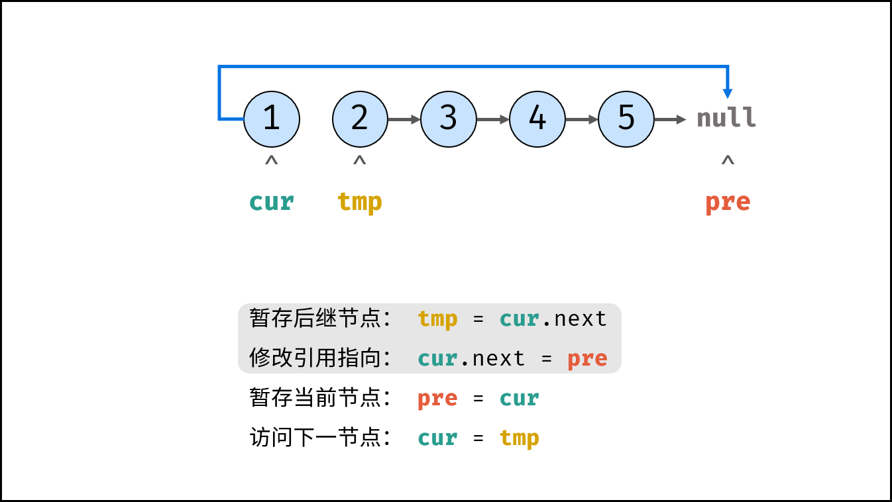
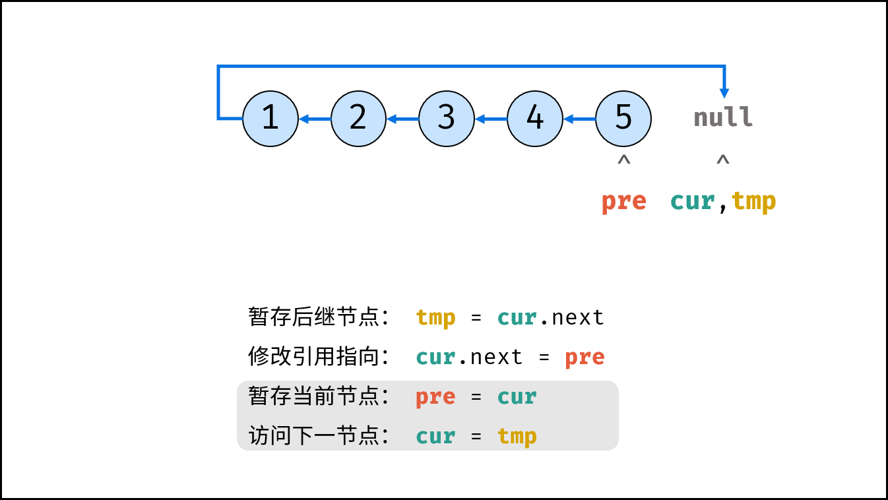
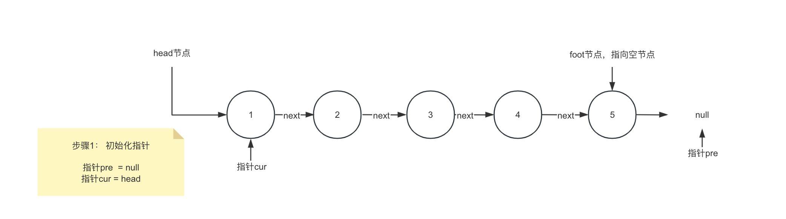

# 反转链表 

https://leetcode.cn/problems/reverse-linked-list/description


## 问题分析<BR>

- 输入: head节点
- 输出: 反转后的新head节点（原foot节点）<BR>

反转前: 


反转后:


思路：

- 显而易见的思路就是穿针引线，模拟现实世界的操作，修改指针的指向，后指向前
- 另外一种偷鸡的办法，我不动指针，我动每个节点本身的值（只对节点的值进行反转）

## 实现

> 之后的讲解都是基于思路1的<BR>
> 关于思路2,在leetcode以及面试中，都是不背允许的解法，因为这道题本质上是在考察对链表的操作。故留在客后作业，自行实现。

### 初学者的第一版实现（暴力解）

思路：

1. 把每个节点都提前找个地方存起来，避免通过指针来寻找某个待操作节点，进行操作
2. 存起来还得保留原始的顺序，这样才能计算出正确的结果，所以需要寻找一个有序的结构进行存储
3. 预处理后，我们拿到了每个顺序上保存的节点信息
4. 逆向迭代每个节点，指针指向前一个节点
5. 过程中对边界进行特殊处理


解析: 

- 规避了本题目最复杂的问题，即是如何通过指针的不断移动来不断迭代的操作反转链表
- 是非标准解法，仅供学习理解入门使用

### 初学者的最优解

思路：

1. 双指针法，通过定义两个指针（当前位置指针、基于当前位置的前一个位置的指针），对当前指针指向的节点进行反转操作，在操作前，通过tmp指针保存当前节点的下一位节点，避免丢失
2. 反转结束后移动指针，对下一轮节点进行同样的反转操作，直到指向空节点
3. 最终返回新的头结点（末尾节点）

> leetcode K神画的图








> 我画的图




### 优美的代码（5行搞定）

思路: 还是利用栈的性质，先入栈的最后访问，不同的是利用函数调用栈的方式（隐式栈）
> 这里超纲了，后面深入学习了程序调用栈，以及递归以后再来会看这一题。（callbak）

```
func reverseList(head *ListNode) *ListNode {
    if head == nil || head.Next == nil {
        return head
    }
    newHead := reverseList(head.Next)
    head.Next.Next = head
    head.Next = nil
    return newHead
}
```


