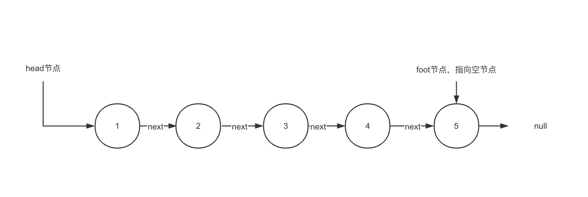

# 反转链表 

https://leetcode.cn/problems/reverse-linked-list/description

## 问题分析 

- 输入: head节点
- 输出: 反转后的新head节点（原foot节点） 

反转前: 

反转后:

思路：

- 显而易见的思路就是穿针引线，模拟现实世界的操作，修改指针的指向，后指向前
- 另外一种偷鸡的办法，我不动指针，我动每个节点本身的值（只对节点的值进行反转）

## 实现

> 之后的讲解都是基于思路1的 
> 关于思路2,在leetcode以及面试中，都是不背允许的解法，因为这道题本质上是在考察对链表的操作。故留在客后作业，自行实现。

### 初学者的实现

### 初学者的普通解法

### 初学者的最优解

### 优美的代码（5行搞定）

